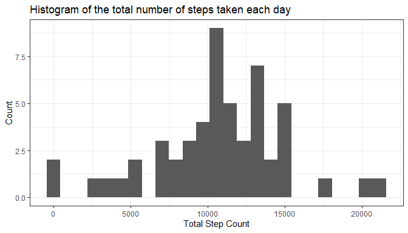
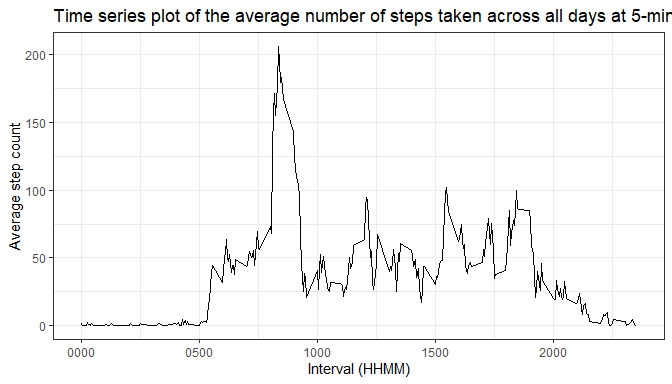
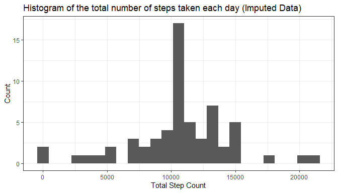
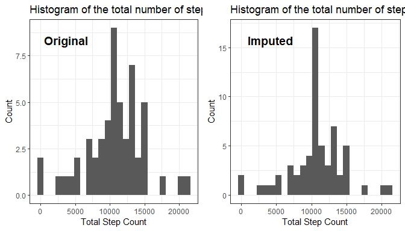
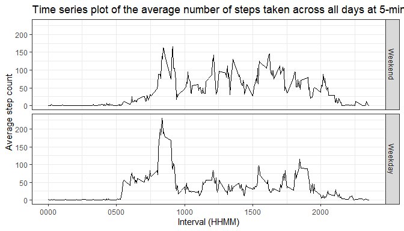

## Loading and preprocessing the data

### Load Libraries

```r
list.of.packages <- c("data.table","plyr","dplyr","tibble", "lubridate", "knitr", "ggplot2", "stringr", "forcats", "ggpubr", "summarytools")
new.packages <- list.of.packages[!(list.of.packages %in% installed.packages()[,"Package"])]
if(length(new.packages)) install.packages(new.packages)
lapply(list.of.packages, require, character.only = TRUE)
```
### Functions

```r
sumnona <- function(x){if (all(is.na(x))) x[NA_integer_] else sum(x, na.rm = TRUE)}
meanona <- function(x){if (all(is.na(x))) x[NA_integer_] else mean(x, na.rm = TRUE)}
```

### Data download

```r
# Create temporary file
temp <- tempfile()

# Download zip into temporary file
download.file(url = "https://github.com/nairarshad/RepData_PeerAssessment1/blob/master/activity.zip?raw=true",
              destfile = temp, mode='wb')

# Unzip the zip file
data.unzip <- unzip(temp)

# Unlink the temporary file
unlink(temp)
```
### Data load

```r
# Read the activity data
activity.data <- read.csv(data.unzip, stringsAsFactors = FALSE) %>% 
    tbl_df() %>%
    mutate(date = as.Date(date))
```

### Data pre-processing and analysis

```r
# Total steps by date
total.steps <- activity.data %>%
    group_by(date) %>%
    summarize(total_steps = sumnona(steps),
              total_intervals = n()) %>%
    mutate(total_intervals = NULL)

# Histogram of the total number of steps taken each day
p1 <- ggplot(data = total.steps, aes(x = total_steps)) 
p1 <- p1 + geom_histogram(bins = 25) 
p1 <- p1 + labs(x = "Total Step Count",
                y = "Count",
                title = "Histogram of the total number of steps taken each day")
p1 <- p1 + theme_bw()

# Mean and median total steps
total.steps.mean <- mean(total.steps$total_steps, na.rm = TRUE)
total.steps.medn <- median(total.steps$total_steps, na.rm = TRUE)

# Average step count for each 5-min interval
interval.5min <- activity.data %>%
    group_by(interval) %>%
    summarize(avg_steps = mean(steps, na.rm = TRUE))

# Time series plot of the average number of steps taken across all days at 5-minute intervals
p2 <- ggplot(data = interval.5min, aes(x = interval, y = avg_steps))
p2 <- p2 + geom_line()
p2 <- p2 + labs(x = "Interval (HHMM)",
                y = "Average step count",
                title = "Time series plot of the average number of steps taken across all days at 5-minute intervals")
p2 <- p2 + scale_x_continuous(labels = function(x) str_pad(x, width = 4, pad = "0"))
p2 <- p2 + theme_bw()

# Which interval corresponds to maximum average steps
maxintrvl <- interval.5min$interval[which.max(interval.5min$avg_steps)]

# How many NAs in the data
countna <- sum(is.na(activity.data$steps))

# Inititalize df for manioulation: impute for NAs
activity.data.nona <- as.data.frame(activity.data)

# Row-wise identify NA and replace with interval average
for(i in 1:nrow(activity.data.nona)){
    if(is.na(activity.data.nona[i,"steps"])){
        intrvl <- activity.data.nona[i,"interval"]
        activity.data.nona[i,"steps"] <- 
            interval.5min$avg_steps[interval.5min$interval==intrvl]
    }
}

# Total steps from imputed data by date
total.steps.nona <- activity.data.nona %>%
    group_by(date) %>%
    summarize(total_steps = sumnona(steps),
              total_intervals = n()) %>%
    mutate(total_intervals = NULL)

# Histogram of the total number of steps taken each day (Imputed Data)
p3 <- ggplot(data = total.steps.nona, aes(x = total_steps)) 
p3 <- p3 + geom_histogram(bins = 25) 
p3 <- p3 + labs(x = "Total Step Count",
                y = "Count",
                title = "Histogram of the total number of steps taken each day (Imputed Data)")
p3 <- p3 + theme_bw()

# Mean and median total steps after imputing
total.steps.nona.mean <- mean(total.steps.nona$total_steps, na.rm = TRUE)
total.steps.nona.medn <- median(total.steps.nona$total_steps, na.rm = TRUE)

# Backup the imputed data
activity.data.nona.bc <- activity.data.nona
activity.data.nona <- NULL

# Add factor column whether Weekday/Weekend
activity.data.nona <- activity.data.nona.bc %>%
    mutate(day = fct_collapse(factor(weekdays(date, abbreviate = TRUE)), 
                              Weekend = c("Sat","Sun"),
                              Weekday = c("Mon","Tue","Wed","Thu","Fri"))) %>%
    mutate(day = factor(day, levels = c("Weekend","Weekday")))

# Average by wday and interval
wday.mean <- activity.data.nona %>%
    tbl_df() %>%
    group_by(day, interval) %>%
    summarize(avg_steps = mean(steps, na.rm = TRUE))

# Time series plot of the average number of steps taken across all days at 5-minute intervals
p4 <- ggplot(data = wday.mean, aes(x = interval, y = avg_steps))
p4 <- p4 + geom_line()
p4 <- p4 + labs(x = "Interval (HHMM)",
                y = "Average step count",
                title = "Time series plot of the average number of steps taken across all days at 5-minute intervals")
p4 <- p4 + scale_x_continuous(labels = function(x) str_pad(x, width = 4, pad = "0"))
p4 <- p4 + facet_grid(day~.)
p4 <- p4 + theme_bw()
```

## What is mean total number of steps taken per day?

**Q:** Calculate the total number of steps taken per day.

**A:** <!--html_preserve--><div class="container st-container">
<h3>Data Frame Summary</h3>
<h4>total.steps</h4>
<strong>Dimensions</strong>: 61 x 2
  <br/><strong>Duplicates</strong>: 0
<br/>
<table class="table table-striped table-bordered st-table st-table-striped st-table-bordered st-multiline ">
  <thead>
    <tr>
      <th align="center" class="st-protect-top-border"><strong>No</strong></th>
      <th align="center" class="st-protect-top-border"><strong>Variable</strong></th>
      <th align="center" class="st-protect-top-border"><strong>Stats / Values</strong></th>
      <th align="center" class="st-protect-top-border"><strong>Freqs (% of Valid)</strong></th>
      <th align="center" class="st-protect-top-border"><strong>Graph</strong></th>
      <th align="center" class="st-protect-top-border"><strong>Valid</strong></th>
      <th align="center" class="st-protect-top-border"><strong>Missing</strong></th>
    </tr>
  </thead>
  <tbody>
    <tr>
      <td align="center">1</td>
      <td align="left">date
[Date]</td>
      <td align="left">min : 2012-10-01
med : 2012-10-31
max : 2012-11-30
range : 1m 29d</td>
      <td align="left" style="vertical-align:middle">61 distinct values</td>
      <td align="left" style="vertical-align:middle;padding:0;background-color:transparent"></td>
      <td align="center">61
(100%)</td>
      <td align="center">0
(0%)</td>
    </tr>
    <tr>
      <td align="center">2</td>
      <td align="left">total_steps
[integer]</td>
      <td align="left">Mean (sd) : 10766.2 (4269.2)
min < med < max:
41 < 10765 < 21194
IQR (CV) : 4453 (0.4)</td>
      <td align="left" style="vertical-align:middle">53 distinct values</td>
      <td align="left" style="vertical-align:middle;padding:0;background-color:transparent"></td>
      <td align="center">53
(86.89%)</td>
      <td align="center">8
(13.11%)</td>
    </tr>
  </tbody>
</table>
<p>Generated by <a href='https://github.com/dcomtois/summarytools'>summarytools</a> 0.9.5 (<a href='https://www.r-project.org/'>R</a> version 3.6.1)<br/>2020-02-18</p>
</div><!--/html_preserve-->


**Q:** Make a histogram of the total number of steps taken each day.

**A:** 
<!-- -->


**Q:** Calculate and report the mean and median of the total number of steps taken per day

**A:** For the total number of steps taken per day, the mean is 1.0766189\times 10^{4} and the median is 10765.


## What is the average daily activity pattern?

**Q:** Make a time series plot of the 5-minute interval (x-axis) and the average number of steps taken, averaged across all days (y-axis)

**A:** 
<!-- -->


**Q:** Which 5-minute interval, on average across all the days in the dataset, contains the maximum number of steps?

**A:** 835 is the interval that corresponds to the maximum average number of steps.


## Imputing missing values

**Q:** Calculate and report the total number of missing values in the dataset.

**A:** 2304 is the number of missing values in the dataset.


**Q:** Devise a strategy for filling in all of the missing values in the dataset.

**A:** Missing values are replaced by the average value across all days corresponding to the interval. This helps the dataset retain the properties of its initial distribution.


**Q:** Create a new dataset that is equal to the original dataset but with the missing data filled in.

**A:** <!--html_preserve--><div class="container st-container">
<h3>Data Frame Summary</h3>
<h4>activity.data.nona.bc</h4>
<strong>Dimensions</strong>: 17568 x 3
  <br/><strong>Duplicates</strong>: 0
<br/>
<table class="table table-striped table-bordered st-table st-table-striped st-table-bordered st-multiline ">
  <thead>
    <tr>
      <th align="center" class="st-protect-top-border"><strong>No</strong></th>
      <th align="center" class="st-protect-top-border"><strong>Variable</strong></th>
      <th align="center" class="st-protect-top-border"><strong>Stats / Values</strong></th>
      <th align="center" class="st-protect-top-border"><strong>Freqs (% of Valid)</strong></th>
      <th align="center" class="st-protect-top-border"><strong>Graph</strong></th>
      <th align="center" class="st-protect-top-border"><strong>Valid</strong></th>
      <th align="center" class="st-protect-top-border"><strong>Missing</strong></th>
    </tr>
  </thead>
  <tbody>
    <tr>
      <td align="center">1</td>
      <td align="left">steps
[numeric]</td>
      <td align="left">Mean (sd) : 37.4 (105.3)
min < med < max:
0 < 0 < 806
IQR (CV) : 27 (2.8)</td>
      <td align="left" style="vertical-align:middle">869 distinct values</td>
      <td align="left" style="vertical-align:middle;padding:0;background-color:transparent"></td>
      <td align="center">17568
(100%)</td>
      <td align="center">0
(0%)</td>
    </tr>
    <tr>
      <td align="center">2</td>
      <td align="left">date
[Date]</td>
      <td align="left">min : 2012-10-01
med : 2012-10-31
max : 2012-11-30
range : 1m 29d</td>
      <td align="left" style="vertical-align:middle">61 distinct values</td>
      <td align="left" style="vertical-align:middle;padding:0;background-color:transparent"></td>
      <td align="center">17568
(100%)</td>
      <td align="center">0
(0%)</td>
    </tr>
    <tr>
      <td align="center">3</td>
      <td align="left">interval
[integer]</td>
      <td align="left">Mean (sd) : 1177.5 (692.5)
min < med < max:
0 < 1177.5 < 2355
IQR (CV) : 1177.5 (0.6)</td>
      <td align="left" style="vertical-align:middle">288 distinct values</td>
      <td align="left" style="vertical-align:middle;padding:0;background-color:transparent"></td>
      <td align="center">17568
(100%)</td>
      <td align="center">0
(0%)</td>
    </tr>
  </tbody>
</table>
<p>Generated by <a href='https://github.com/dcomtois/summarytools'>summarytools</a> 0.9.5 (<a href='https://www.r-project.org/'>R</a> version 3.6.1)<br/>2020-02-18</p>
</div><!--/html_preserve-->


**Q:** Make a histogram of the total number of steps taken each day 

**A:** 
<!-- -->


**Q:** Calculate and report the mean and median total number of steps taken per day. 

**A:** For the total number of steps taken per day from the imputed data, the mean is 1.0766189\times 10^{4} and the median is 1.0766189\times 10^{4}.


**Q:** Do these values differ from the estimates from the first part of the assignment? 

**A:** New mean - Original mean = 0. New median - Original median = 1.1886792


**Q:** What is the impact of imputing missing data on the estimates of the total daily number of steps?

**A:** There are 8 days for which there is no data in any interval. These obtain the long-term averages. The total daily number of steps changes as:
<!-- -->


## Are there differences in activity patterns between weekdays and weekends?

**Q:** Create a new factor variable in the dataset with two levels – “weekday” and “weekend” indicating whether a given date is a weekday or weekend day.

**A:** <!--html_preserve--><div class="container st-container">
<h3>Data Frame Summary</h3>
<h4>activity.data.nona</h4>
<strong>Dimensions</strong>: 17568 x 4
  <br/><strong>Duplicates</strong>: 0
<br/>
<table class="table table-striped table-bordered st-table st-table-striped st-table-bordered st-multiline ">
  <thead>
    <tr>
      <th align="center" class="st-protect-top-border"><strong>No</strong></th>
      <th align="center" class="st-protect-top-border"><strong>Variable</strong></th>
      <th align="center" class="st-protect-top-border"><strong>Stats / Values</strong></th>
      <th align="center" class="st-protect-top-border"><strong>Freqs (% of Valid)</strong></th>
      <th align="center" class="st-protect-top-border"><strong>Graph</strong></th>
      <th align="center" class="st-protect-top-border"><strong>Valid</strong></th>
      <th align="center" class="st-protect-top-border"><strong>Missing</strong></th>
    </tr>
  </thead>
  <tbody>
    <tr>
      <td align="center">1</td>
      <td align="left">steps
[numeric]</td>
      <td align="left">Mean (sd) : 37.4 (105.3)
min < med < max:
0 < 0 < 806
IQR (CV) : 27 (2.8)</td>
      <td align="left" style="vertical-align:middle">869 distinct values</td>
      <td align="left" style="vertical-align:middle;padding:0;background-color:transparent"></td>
      <td align="center">17568
(100%)</td>
      <td align="center">0
(0%)</td>
    </tr>
    <tr>
      <td align="center">2</td>
      <td align="left">date
[Date]</td>
      <td align="left">min : 2012-10-01
med : 2012-10-31
max : 2012-11-30
range : 1m 29d</td>
      <td align="left" style="vertical-align:middle">61 distinct values</td>
      <td align="left" style="vertical-align:middle;padding:0;background-color:transparent"></td>
      <td align="center">17568
(100%)</td>
      <td align="center">0
(0%)</td>
    </tr>
    <tr>
      <td align="center">3</td>
      <td align="left">interval
[integer]</td>
      <td align="left">Mean (sd) : 1177.5 (692.5)
min < med < max:
0 < 1177.5 < 2355
IQR (CV) : 1177.5 (0.6)</td>
      <td align="left" style="vertical-align:middle">288 distinct values</td>
      <td align="left" style="vertical-align:middle;padding:0;background-color:transparent"></td>
      <td align="center">17568
(100%)</td>
      <td align="center">0
(0%)</td>
    </tr>
    <tr>
      <td align="center">4</td>
      <td align="left">day
[factor]</td>
      <td align="left">1. Weekend
2. Weekday</td>
      <td align="left" style="padding:0;vertical-align:middle"><table style="border-collapse:collapse;border:none;margin:0"><tr style="background-color:transparent"><td style="padding:0 5px 0 7px;margin:0;border:0" align="right">4608</td><td style="padding:0 2px 0 0;border:0;" align="left">(</td><td style="padding:0;border:0" align="right">26.2%</td><td style="padding:0 4px 0 2px;border:0" align="left">)</td></tr><tr style="background-color:transparent"><td style="padding:0 5px 0 7px;margin:0;border:0" align="right">12960</td><td style="padding:0 2px 0 0;border:0;" align="left">(</td><td style="padding:0;border:0" align="right">73.8%</td><td style="padding:0 4px 0 2px;border:0" align="left">)</td></tr></table></td>
      <td align="left" style="vertical-align:middle;padding:0;background-color:transparent"></td>
      <td align="center">17568
(100%)</td>
      <td align="center">0
(0%)</td>
    </tr>
  </tbody>
</table>
<p>Generated by <a href='https://github.com/dcomtois/summarytools'>summarytools</a> 0.9.5 (<a href='https://www.r-project.org/'>R</a> version 3.6.1)<br/>2020-02-18</p>
</div><!--/html_preserve-->


**Q:** Make a panel plot containing a time series plot of the 5-minute interval (x-axis) and the average number of steps taken, averaged across all weekday days or weekend days (y-axis).

**A:** 
<!-- -->


